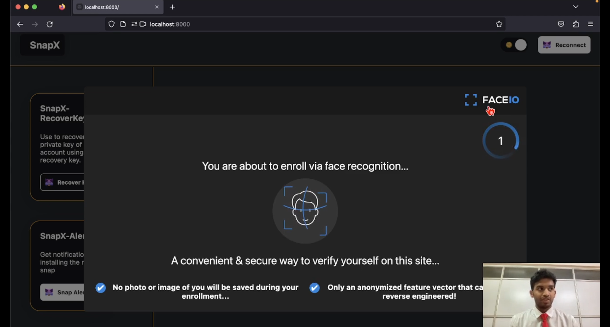
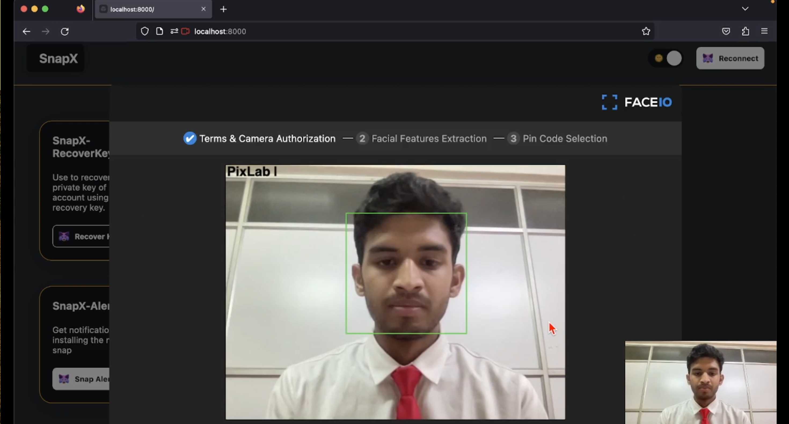
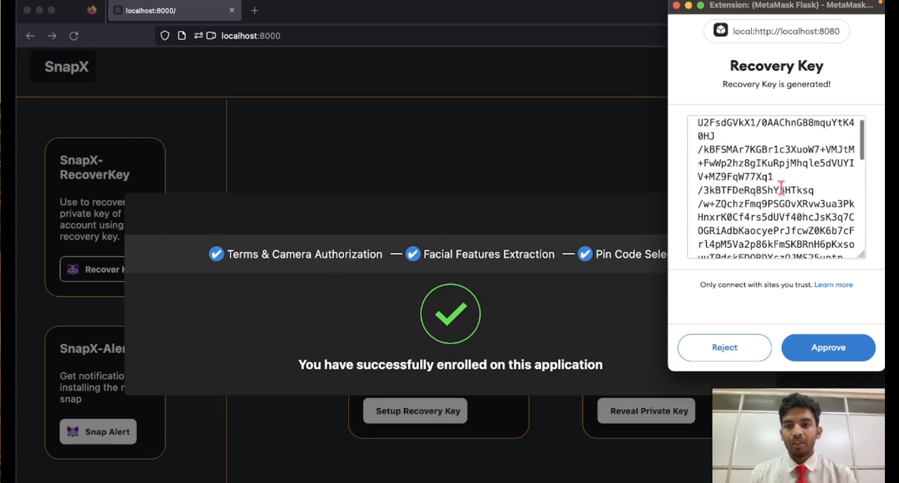
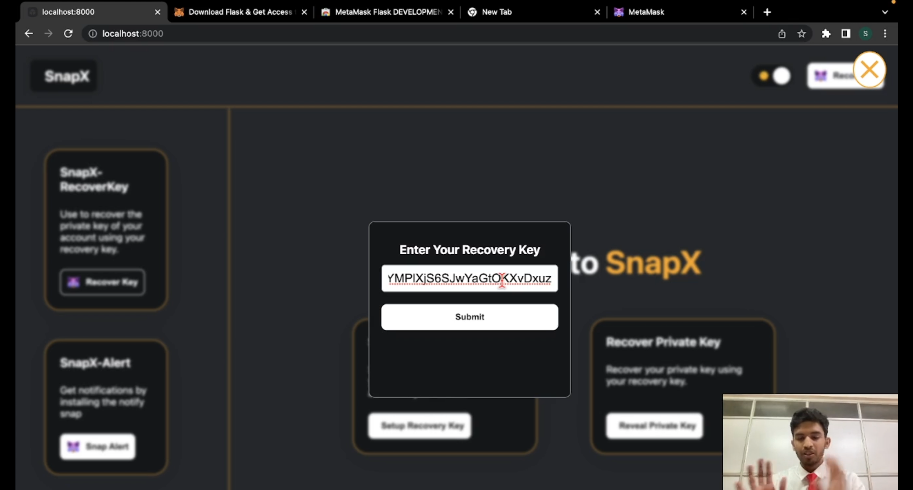
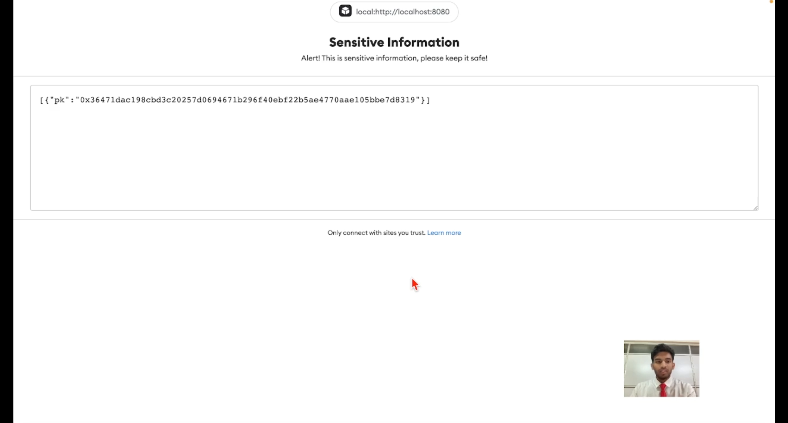
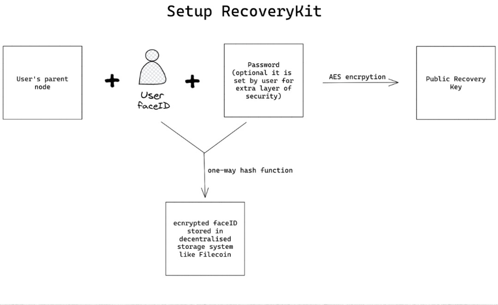
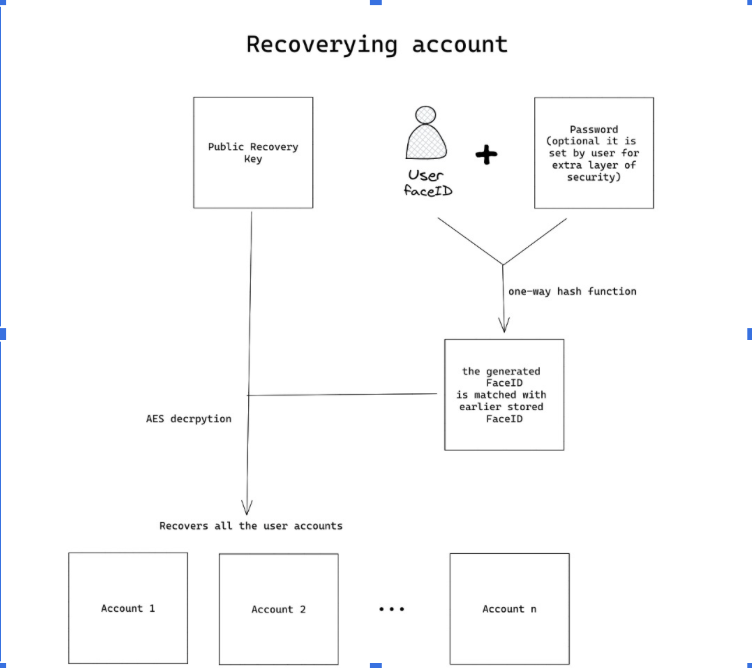

# Account Recovery using Biometric Authentication
> A Metamask snap made specifically for the account recovery using biometric authentication. (Thesis Project)

## Demo
To see the working, please click [here](https://drive.google.com/file/d/1u2BdfqnMVhGtg6m2rgWXqsPomjfUqebc/view?usp=sharing).

## Setup and Run
  - #### Run the following commands:
  
```
yarn install
yarn start
```
> *Note*: If the build takes too long, kill the process and run `yarn start` again.
    

  - #### After this go to [localhost:8000](https://localhost:8000)

  - #### Now start exploring the Snap

- ## RecoveryKit
    This is a recovery snap which helps user to recover private key using biometric authentication:
    ### Steps Involved
    - Open the Dapp.
    - Install Metamask flask and click on connect.
    - Click on recovery kit in the sidebar.
      - ### Setup up recovery key:
        - Click on setup recovery key.
        > 
        - Follow the on-screen instructions to scan your face.
        > 
        - Set the pin.
        - Get your recovery key and copy it to some place.
        > 
      - ### Recover private key:
        - In order to retrieve the lost accounts switch to the respective network in which the accounts was present.
        - Click on get private key.
        - Enter the recovery key of the wallet you need to recover, which was generated using your above.
        > 
        - Follow the on screen instructions to authenticate your face.
        - Use the recovered private keys to import your accounts in the new wallet using the metamask extension.
        > 
<br>

## Problem Statement
  ### Pain points users
 - If users have lost their private key, they may struggle to recover their MetaMask account.
 - Private key is very sensitive hence the snap need to safely store it.
 - If users have forgotten their seed phrase, they may have trouble accessing their account.

 ### Proposed Solution
  - In case where the users lose their private key, the snap provide a method to recover the wallet via recovery key.
  - Since the recoveryKey is public (since it is encrypted) the snap can freely store it anywhere.

  ### Architecture
  
  